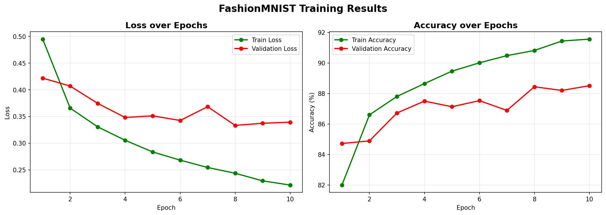

# Base Task — Fashion-MNIST Classification

## Problem Statement
Implement a Neural Network using PyTorch and train it on the Fashion-MNIST 
dataset. The model classifies clothing images into 10 categories.

## Model Architecture
Input (28×28 image) → Flatten → Linear(784→256) + ReLU → 
Linear(256→128) + ReLU → Linear(128→10) → Output

## Training Details
| Parameter | Value |
|-----------|-------|
| Optimizer | Adam |
| Learning Rate | 0.001 |
| Batch Size | 64 |
| Epochs | 10 |
| Loss Function | CrossEntropyLoss |
| Random Seed | 67 |

## Results
| Metric | Value |
|--------|-------|
| Final Validation Accuracy | ~88-90% |

## Training Plots

## Files
| File | Description |
|------|-------------|
| `notebooks/fashion_mnist.ipynb` | Complete training notebook |
| `saved_models/model_weights.pkl` | Saved model weights |
| `submission.csv` | Test predictions |

## How to Run
1. Open `fashion_mnist.ipynb` in Google Colab
2. Runtime → Change runtime type → T4 GPU
3. Run all cells in order

*Thank you Spider R&D for this opportunity!*